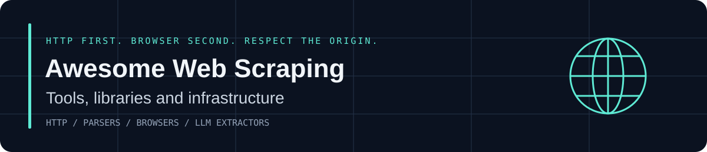

# Awesome Web Scraping [](https://awesome.re)

[](http://creativecommons.org/publicdomain/zero/1.0/)
[](CONTRIBUTING.md)
[](https://github.com)

> A curated list of tools, libraries, platforms, and guides for extracting public data from the web — HTTP clients, parsers, crawlers, browsers, proxies, AI extractors, and the boring infrastructure that keeps scrapers alive.

Web scraping is how you turn pages into datasets. The stack changed a lot: static HTML still yields to `requests` + a parser, JavaScript apps need a real browser, and LLM pipelines want markdown instead of messy DOM trees. This list is the map.

**Use public data responsibly.** Respect `robots.txt`, terms of service, rate limits, copyright, and privacy law. Prefer official APIs when they exist. This list is for legitimate research, monitoring, and product work — not for attacking sites or harvesting personal data you have no right to collect.

---

## Contents

- [Start here](#start-here)
- [Decision guide](#decision-guide)
- [HTTP clients](#http-clients)
- [HTML & XML parsers](#html--xml-parsers)
- [Frameworks by language](#frameworks-by-language)
  - [Python](#python)
  - [JavaScript / TypeScript](#javascript--typescript)
  - [Go](#go)
  - [Rust](#rust)
  - [Other languages](#other-languages)
- [Browser automation](#browser-automation)
- [AI & LLM scraping](#ai--llm-scraping)
- [Cloud & no-code platforms](#cloud--no-code-platforms)
- [Proxies & networking](#proxies--networking)
- [CAPTCHA services](#captcha-services)
- [Stealth & fingerprint tools](#stealth--fingerprint-tools)
- [Scheduling & queues](#scheduling--queues)
- [Storage & pipelines](#storage--pipelines)
- [CLI tools](#cli-tools)
- [Best practices](#best-practices)
- [Legal & ethics](#legal--ethics)
- [Learning](#learning)
- [Communities](#communities)
- [Related lists](#related-lists)
- [Contributing](#contributing)
- [License](#license)

---

## Start here

| You have… | Reach for… |
| --- | --- |
| A few static pages | `httpx` / `requests` + Beautiful Soup or Cheerio |
| Thousands of URLs, same site | Scrapy or Crawlee |
| A React / Next / SPA site | Playwright (or Crawlee + Playwright) |
| Markdown for an LLM / RAG pipeline | Firecrawl or Crawl4AI |
| No desire to write code | Apify, Browse AI, or an official API |
| Extreme throughput | Colly (Go) or spider-rs (Rust) |
| Selectors that break every redesign | Scrapling or an LLM extractor |

Rule of thumb: **HTTP first, browser second, paid platform last.** Browsers are slow and expensive. Use them only when the HTML from a plain request is empty.

---

## Decision guide

```
Need structured data from the web?
│
├─ Official API exists? ──────────────────────── use the API
│
├─ Page is static HTML?
│     └─ Small job  → HTTP client + parser
│     └─ Large job  → Scrapy / Crawlee / Colly
│
├─ Page needs JavaScript?
│     └─ Playwright  (best default in 2026)
│     └─ Puppeteer   (Chrome-only, huge ecosystem)
│     └─ Selenium    (legacy / multi-language shops)
│
└─ You want "describe the data, get JSON"?
      └─ Firecrawl / Crawl4AI / ScrapeGraphAI
```

### Framework snapshot

| | Scrapy | Crawlee | Colly | Playwright |
| --- | --- | --- | --- | --- |
| Language | Python | JS / Python | Go | Multi |
| Async | Twisted | asyncio / native | goroutines | Yes |
| JS rendering | Plugin | Built-in | No | Native |
| Rate limits | Built-in | Built-in | Manual | Manual |
| Best for | Production Python crawls | Modern JS/Python crawls | Fast HTTP at scale | Dynamic pages |

### Browser snapshot

| | Playwright | Puppeteer | Selenium |
| --- | --- | --- | --- |
| Browsers | Chromium, Firefox, WebKit | Chrome / Chromium | All major |
| Languages | JS, Python, Java, C#, .NET | JS (official) | Most |
| Auto-wait | Yes | Manual | Manual |
| Speed | Fast | Fast | Slower |
| Default pick for new scrapers | **Yes** | Chrome-only shops | Existing Selenium fleets |

---

## HTTP clients

The request layer. Prefer HTTP/2, connection pooling, and timeout discipline.

- [httpx](https://github.com/encode/httpx) — Modern Python client. Sync + async, HTTP/2, HTTP/3 experimental, first-class timeouts.
- [requests](https://github.com/psf/requests) — The Python classic. Still the right choice for small scripts.
- [aiohttp](https://github.com/aio-libs/aiohttp) — Async Python client for high concurrency.
- [got](https://github.com/sindresorhus/got) — Human-friendly HTTP client for Node.js.
- [undici](https://github.com/nodejs/undici) — Node's own HTTP/1.1 client. Fast, low-level.
- [axios](https://github.com/axios/axios) — Ubiquitous JS client. Fine for simple jobs.
- [reqwest](https://github.com/seanmonstar/reqwest) — Ergonomic async HTTP for Rust.
- [resty](https://github.com/go-resty/resty) — Simple, fluent HTTP client for Go.
- [curl](https://curl.se) — The universal CLI. Pair with `curl-impersonate` when TLS fingerprints matter.
- [curl_cffi](https://github.com/yifeikong/curl_cffi) — Python bindings for curl-impersonate. Browser-like TLS/JA3 without a browser.

---

## HTML & XML parsers

- [Beautiful Soup](https://www.crummy.com/software/BeautifulSoup/) — Forgiving HTML parser. The on-ramp for every Python scraper.
- [lxml](https://lxml.de) — C-speed XPath and CSS on CPython. Use as Beautiful Soup's backend or on its own.
- [selectolax](https://github.com/rushter/selectolax) — Modest/Lexbor engine. Often 10× faster than lxml on messy HTML.
- [Parsel](https://github.com/scrapy/parsel) — Scrapy's CSS + XPath selectors, usable without Scrapy.
- [Cheerio](https://github.com/cheeriojs/cheerio) — jQuery-shaped parser for Node. No browser, very fast.
- [jsdom](https://github.com/jsdom/jsdom) — Full DOM in Node when Cheerio is not enough.
- [linkedom](https://github.com/WebReflection/linkedom) — Lightweight DOM for workers and scrapers.
- [trafilatura](https://github.com/adbar/trafilatura) — Article and main-content extraction. Excellent boilerplate killer.
- [readability](https://github.com/mozilla/readability) — Mozilla's reader-mode algorithm. Ports exist in most languages.
- [newspaper3k](https://github.com/codelucas/newspaper) — News sites: authors, dates, text, keywords.
- [htmlq](https://github.com/mgdm/htmlq) — `jq` for HTML. Pipe curl into CSS selectors on the command line.

---

## Frameworks by language

### Python

- [Scrapy](https://github.com/scrapy/scrapy) — The production crawler. Spiders, middlewares, item pipelines, built-in export, Autothrottle.
- [Crawlee for Python](https://github.com/apify/crawlee-python) — Beautiful Soup and Playwright crawlers with session pools and autoscaling.
- [Scrapling](https://github.com/D4Vinci/Scrapling) — Adaptive selectors that relocate after layout changes. Strong fit when sites churn weekly.
- [Botasaurus](https://github.com/omkarcloud/botasaurus) — Batteries-included: browser, cache, parallelism, anti-detect helpers.
- [MechanicalSoup](https://github.com/MechanicalSoup/MechanicalSoup) — Stateful browsing with forms and cookies. Mechanize spiritual successor.
- [Grab](https://github.com/lorien/grab) — Request + parse + spider in one toolkit.
- [pyspider](https://github.com/binux/pyspider) — Web UI for spiders. Older, still useful for teams that want a dashboard.
- [Portia](https://github.com/scrapinghub/portia) — Visual Scrapy annotator. Point, click, generate a spider.
- [feedparser](https://github.com/kurtmckee/feedparser) — RSS / Atom. Often cheaper than scraping the HTML version of a blog.

### JavaScript / TypeScript

- [Crawlee](https://github.com/apify/crawlee) — Apify's framework. Cheerio, Playwright, and Puppeteer crawlers, request queues, session rotation.
- [x-ray](https://github.com/matthewmueller/x-ray) — Declarative schemas. Describe the page, get JSON.
- [node-crawler](https://github.com/bda-research/node-crawler) — Classic pool + rate-limit + retry crawler.
- [Osmosis](https://github.com/rchipka/node-osmosis) — Streaming HTML/XML parser with CSS and XPath.
- [Apify SDK](https://github.com/apify/apify-sdk-js) — Actor runtime, storages, and proxies on top of Crawlee.

### Go

- [Colly](https://github.com/gocolly/colly) — Elegant, fast, callback-based. The default Go scraper.
- [Ferret](https://github.com/MontFerret/ferret) — Declarative query language for the web. SQL-ish scraping.
- [rod](https://github.com/go-rod/rod) — High-level Chrome DevTools. Playwright energy, Go types.
- [chromedp](https://github.com/chromedp/chromedp) — Drive Chrome from Go without a heavy wrapper.
- [hakrawler](https://github.com/hakluke/hakrawler) — Fast endpoint discovery crawler. Recon-oriented.

### Rust

- [spider](https://github.com/spider-rs/spider) — Very fast crawler. Use when Python is the bottleneck.
- [scraper](https://github.com/causal-agent/scraper) — HTML parsing with CSS selectors on html5ever.
- [reqwest + select](https://github.com/utkarshkukreti/select.rs) — The DIY Rust stack.

### Other languages

- [Goutte](https://github.com/FriendsOfPHP/Goutte) — PHP. Symfony BrowserKit + DomCrawler. Simple and solid.
- [Symfony DomCrawler](https://symfony.com/doc/current/components/dom_crawler.html) — CSS/XPath for PHP without a full spider.
- [Nokogiri](https://github.com/sparklemotion/nokogiri) — Ruby's HTML/XML workhorse.
- [Mechanize (Ruby)](https://github.com/sparklemotion/mechanize) — Stateful browser emulator for Ruby.
- [crawler4j](https://github.com/yasserg/crawler4j) — Simple multi-thread Java crawler.
- [Apache Nutch](https://nutch.apache.org) — Hadoop-era web-scale crawler. Still the right tool for some search indexes.
- [Html Agility Pack](https://github.com/zzzprojects/html-agility-pack) — .NET HTML parser used in half of all C# scrapers.

---

## Browser automation

Use a browser when the server returns a shell and JavaScript fills in the data.

- [Playwright](https://playwright.dev) — Microsoft. Chromium, Firefox, WebKit. Auto-wait, tracing, multiple languages. Best default.
- [Puppeteer](https://pptr.dev) — Google. Chrome DevTools Protocol. Enormous ecosystem.
- [Selenium](https://www.selenium.dev) — The industry standard. WebDriver everywhere. Heavier and easier to fingerprint.
- [Cypress](https://www.cypress.io) — Testing tool that can scrape. Not built for fleets of crawlers.
- [Camoufox](https://camoufox.com) — Stealth-oriented Firefox automation.
- [Browserbase](https://www.browserbase.com) — Hosted headless browsers with session APIs.
- [Steel](https://steel.dev) — Browser API aimed at AI agents.
- [lightpanda](https://github.com/lightpanda-io/browser) — Fast headless browser written for automation, not humans.

Headless lists worth bookmarking: [dhamaniasad/HeadlessBrowsers](https://github.com/dhamaniasad/HeadlessBrowsers).

---

## AI & LLM scraping

Pages become markdown or JSON. Selectors become prompts. Still verify the output — models invent fields.

- [Firecrawl](https://www.firecrawl.dev) — Site-to-markdown / structured extract API. Popular RAG front door.
- [Crawl4AI](https://github.com/unclecode/crawl4ai) — Open-source LLM-friendly crawler. Self-hostable.
- [ScrapeGraphAI](https://github.com/ScrapeGraphAI/Scrapegraph-ai) — Graph of LLM extractors. "Describe it in English."
- [Stagehand](https://github.com/browserbase/stagehand) — Natural-language browser control on Playwright.
- [browser-use](https://github.com/browser-use/browser-use) — Make websites usable by AI agents.
- [Jina Reader](https://jina.ai/reader) — `r.jina.ai/<url>` → clean markdown. Dead-simple prototype path.
- [Spider.cloud](https://spider.cloud) — Crawler + LLM extract API.

---

## Cloud & no-code platforms

When you want queues, proxies, browsers, and a dashboard without building them.

- [Apify](https://apify.com) — Actor platform, store of ready scrapers, Crawlee-native.
- [Zyte (Scrapinghub)](https://www.zyte.com) — Scrapy Cloud, Smart Proxy, autoextract.
- [Bright Data](https://brightdata.com) — Proxies plus scraping browser and datasets.
- [Oxylabs](https://oxylabs.io) — Proxies and scraper APIs.
- [ScrapingBee](https://www.scrapingbee.com) — Headless browser as an API.
- [ScraperAPI](https://www.scraperapi.com) — Proxy rotation + JS rendering endpoint.
- [Browse AI](https://www.browse.ai) — Point-and-click robots for non-engineers.
- [ParseHub](https://www.parsehub.com) — Visual scraper, desktop app.
- [Octoparse](https://www.octoparse.com) — Visual cloud scraper.
- [Diffbot](https://www.diffbot.com) — Automatic article / product / discussion extraction.

Prefer official data products first: many of these vendors also sell datasets so you never hit the site.

---

## Proxies & networking

Start cheap. Upgrade only when the target blocks datacenter IPs.

| Type | Speed | Trust | Cost | Typical use |
| --- | --- | --- | --- | --- |
| Datacenter | Fast | Low | Low | Open, lightly protected sites |
| Residential | Medium | High | High | Sites that score IP reputation |
| Mobile (4G/5G) | Medium | Highest | Highest | Aggressive bot management |
| ISP / static residential | Fast | High | Medium-high | Sticky sessions, account work |

Well-known providers (evaluate independently): Bright Data, Oxylabs, Smartproxy, IPRoyal, NetNut, SOAX, Webshare, PacketStream.

Supporting libraries:

- [proxy-chain](https://github.com/apify/proxy-chain) — Node proxy with upstream rotation.
- [requests[socks]](https://requests.readthedocs.io/en/latest/user/advanced/#socks) — SOCKS support for Python requests.
- [protego](https://github.com/scrapy/protego) — Pure-Python `robots.txt` parser.
- [robotexclusionrulesparser](https://pypi.org/project/robotexclusionrulesparser/) — Another robots implementation.

---

## CAPTCHA services

Last resort. If you are solving CAPTCHAs at volume, revisit whether you should be hitting that endpoint at all, and whether an official API exists.

- [2Captcha](https://2captcha.com)
- [Anti-Captcha](https://anti-captcha.com)
- [CapSolver](https://www.capsolver.com)
- [CapMonster Cloud](https://capmonster.cloud)

These are third-party human/AI solving APIs. Using them may violate a site's terms. Know the rules of the jurisdiction and the target before you wire one in.

---

## Stealth & fingerprint tools

Sites fingerprint TLS, HTTP/2 settings, JS APIs, fonts, WebGL, and behavior. These projects exist so legitimate automation looks like a normal browser session. Do not use them to break into accounts, evade law enforcement, or harvest data you are not allowed to take.

- [curl-impersonate](https://github.com/lwthiker/curl-impersonate) — curl that speaks Chrome/Firefox TLS.
- [curl_cffi](https://github.com/yifeikong/curl_cffi) — Same idea, Python.
- [undetected-chromedriver](https://github.com/ultrafunkamsterdam/undetected-chromedriver) — Selenium patch against common Chrome automation flags.
- [rebrowser-patches](https://github.com/rebrowser/rebrowser-patches) — Playwright / Puppeteer patches.
- [Camoufox](https://camoufox.com) — Firefox with anti-fingerprinting work.
- [fake-useragent](https://github.com/fake-useragent/fake-useragent) — Random desktop/mobile UA strings (Python).
- [user-agents](https://github.com/intoli/user-agents) — Generated UA dataset (JS).
- [impersonate](https://github.com/iterweb/impersonate) — Related TLS impersonation work.

A realistic User-Agent is not stealth. JA3/JA4, HTTP/2 SETTINGS, and JS environment leaks matter more.

---

## Scheduling & queues

- [Celery](https://docs.celeryq.dev) — Python distributed tasks. Battle-tested.
- [APScheduler](https://apscheduler.readthedocs.io) — In-process Python scheduler.
- [BullMQ](https://docs.bullmq.io) — Redis jobs for Node.
- [RQ](https://python-rq.org) — Minimal Redis queue for Python.
- [Prefect](https://www.prefect.io) / [Dagster](https://dagster.io) / [Airflow](https://airflow.apache.org) — When scraping is one step in a data platform.
- [GitHub Actions](https://docs.github.com/en/actions) + cron — Fine for tiny, polite jobs. Easy to get banned if you hammer from `github.com` IPs.

---

## Storage & pipelines

- [Item Adapter / Scrapy Feed Exports](https://docs.scrapy.org/en/latest/topics/feed-exports.html) — JSON, JSONL, CSV, XML out of the box.
- [pandas](https://pandas.pydata.org) — Clean, join, and dump to Parquet.
- [DuckDB](https://duckdb.org) — SQL on local files. Perfect crawl warehouse for one machine.
- [PostgreSQL](https://www.postgresql.org) — The default durable store.
- [MongoDB](https://www.mongodb.com) — Schema-flexible crawl dumps.
- [Redis](https://redis.io) — Dedup sets, rate-limit counters, job queues.
- [Apache Kafka](https://kafka.apache.org) — Fan-out when many workers produce records.
- [Great Expectations](https://greatexpectations.io) / [pandera](https://github.com/unionai-oss/pandera) — Schema tests so silent HTML changes do not corrupt the warehouse.

---

## CLI tools

- [httpie](https://httpie.io) — Readable HTTP from the terminal.
- [xh](https://github.com/ducaale/xh) — Friendly curl, written in Rust.
- [htmlq](https://github.com/mgdm/htmlq) — CSS selectors on stdin.
- [pup](https://github.com/ericchiang/pup) — HTML processing, jq-style.
- [miller](https://miller.readthedocs.io) — CSV/JSON reshaping after the scrape.
- [wget](https://www.gnu.org/software/wget/) / [HTTrack](https://www.httrack.com) — Mirror a site. Use `--wait` and `--limit-rate`.
- [waybackpy](https://github.com/akamhy/waybackpy) — Query the Internet Archive instead of hitting the live site.

---

## Best practices

1. **Check for an official API or data dump first.** Scraping is a compatibility layer, not a product strategy.
2. **Read `robots.txt` and the terms.** Honor `Crawl-delay`. Cache the file. Re-check it.
3. **Identify yourself.** A descriptive User-Agent with a contact URL is the grown-up move on public datasets.
4. **Throttle.** Start at 1 request/second/host. Back off on `429` and `503`. Jitter your sleeps.
5. **Cache aggressively.** If the page did not change, do not download it again. ETags and last-modified help.
6. **Idempotent writes.** Dedup on URL + content hash. Crawls get killed mid-run.
7. **Parse defensively.** Missing fields should log, not crash. Snapshot raw HTML when a selector fails.
8. **Separate fetch from parse.** Store the raw response. Re-parse later when the schema changes.
9. **Watch your legal surface.** Personal data, paywalled content, and authenticated sessions are a different conversation from public catalog pages.
10. **Prefer structured feeds.** RSS, sitemaps, and `llms.txt` / markdown endpoints beat CSS selectors.

Minimal polite Python sketch:

```python
import time
import httpx
from bs4 import BeautifulSoup

HEADERS = {
    "User-Agent": "ResearchBot/0.1 (+https://example.com/bot; hello@example.com)"
}

with httpx.Client(headers=HEADERS, timeout=20.0, follow_redirects=True) as client:
    r = client.get("https://example.com/robots.txt")
    r.raise_for_status()
    # parse and honor robots here

    time.sleep(1.0)
    page = client.get("https://example.com/")
    page.raise_for_status()
    soup = BeautifulSoup(page.text, "lxml")
    title = soup.select_one("h1")
    print(title.get_text(strip=True) if title else None)
```

---

## Legal & ethics

This is not legal advice. Laws differ by country. Talk to a lawyer for commercial work.

- **Copyright** still applies to scraped text, images, and code. Collecting is not the same as republishing.
- **Computer misuse / CFAA-style laws** can apply when you bypass access controls, ignore explicit bans, or hit authenticated areas without permission.
- **GDPR, CCPA, and similar regimes** cover personal data. Scraping profiles is not "public so it's fine."
- **Contracts.** Terms of service can create civil liability even when a page is reachable without a login.
- **hiQ v. LinkedIn** and later cases shifted some US thinking on *public* pages, but they did not create a universal right to scrape.
- **Be kind to origin servers.** A "legal" crawl that knocks over a small site is still a bad crawl.

Good primers:

- [Web Scraping Legal Guide (ParseHub)](https://www.parsehub.com/blog/web-scraping-legal/)
- [Zyte: Is web scraping legal?](https://www.zyte.com/learn/is-web-scraping-legal/)
- [Fieldfisher overview of EU/UK issues](https://www.fieldfisher.com)

When in doubt: ask the site owner, buy the data, or use the API.

---

## Learning

- [Official Scrapy tutorial](https://docs.scrapy.org/en/latest/intro/tutorial.html)
- [Playwright docs — scrapers](https://playwright.dev/docs/library)
- [Crawlee Academy / docs](https://crawlee.dev/docs)
- [Apify Academy](https://docs.apify.com/academy) — Free, practical course.
- [Real Python: Beautiful Soup](https://realpython.com/beautiful-soup-web-scraper-python/)
- [ScrapingBee blog](https://www.scrapingbee.com/blog/) — War stories and how-tos.
- [The Web Scraping Club](https://www.thewebscraping.club) — Anti-bot and industry writing.
- [Web Scraping with Python (O'Reilly, Mitchell)](https://www.oreilly.com/library/view/web-scraping-with/9781491985564/) — The standard book.
- [Awesome Python — Web Scraping](https://awesome-python.com/categories/web-scraping/)

---

## Communities

- [r/webscraping](https://www.reddit.com/r/webscraping/)
- [Scrapy Discord / GitHub Discussions](https://github.com/scrapy/scrapy)
- [Crawlee Discord](https://discord.com/invite/jyEM2PRvMU)
- Telegram: `grablab` (English), `grablab_ru` (Russian)
- Stack Overflow tags: `web-scraping`, `scrapy`, `playwright`, `puppeteer`

---

## Related lists

- [lorien/awesome-web-scraping](https://github.com/lorien/awesome-web-scraping) — The original multi-language catalog.
- [sindresorhus/awesome](https://github.com/sindresorhus/awesome) — The meta-list.
- [vinta/awesome-python](https://github.com/vinta/awesome-python) — Python section includes scraping.
- [dhamaniasad/HeadlessBrowsers](https://github.com/dhamaniasad/HeadlessBrowsers)
- [BruceDone/awesome-crawler](https://github.com/BruceDone/awesome-crawler)
- [TheWebScrapingClub/scraping-wiki](https://github.com/TheWebScrapingClub/scraping-wiki) — Anti-bot and infra knowledge base.

---

## Contributing

PRs welcome. See [CONTRIBUTING.md](CONTRIBUTING.md).

Short version:

- One link per line, description ends with a period.
- Only tools you would actually recommend.
- No affiliate dumps, no "my SaaS" unless it is genuinely used.
- New section only if the existing ones cannot hold the item.

---

## License

[](http://creativecommons.org/publicdomain/zero/1.0/)

To the extent possible under law, this list is dedicated to the public domain under [CC0 1.0](http://creativecommons.org/publicdomain/zero/1.0/).
